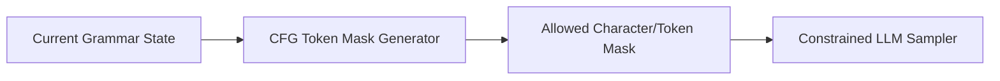

# genpark-cfg-grammar-token-mask-generator-skill

Finite-state token masking engine enforcing Context-Free Grammar (CFG) constraints to ensure 100% syntactically valid model generation.

## Architecture

## Features
- **Deterministic Next-Token Sets**: Guarantees syntax compliance.
- **Zero Dependencies**: 100% Python standard library.
